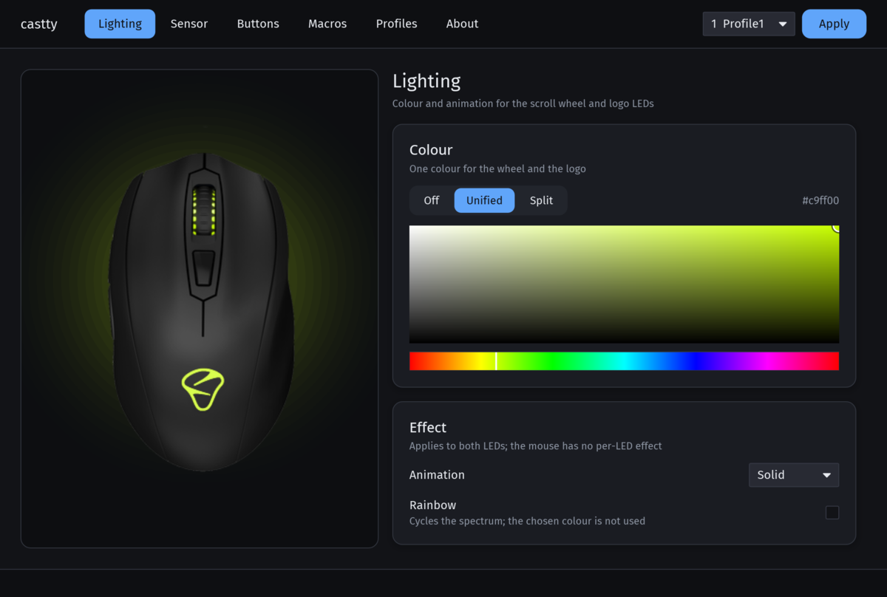
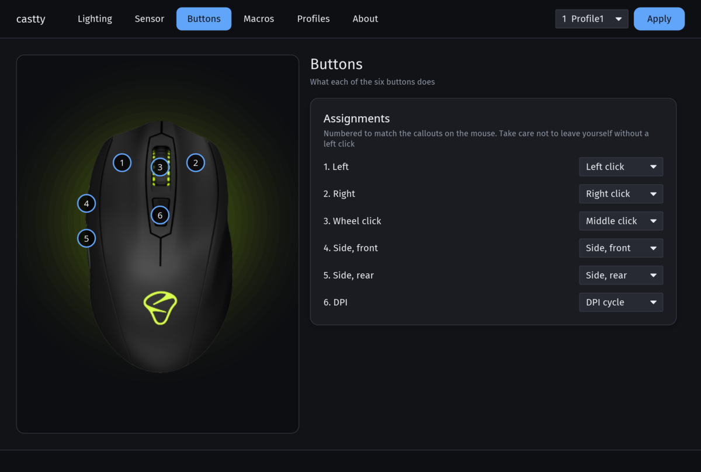
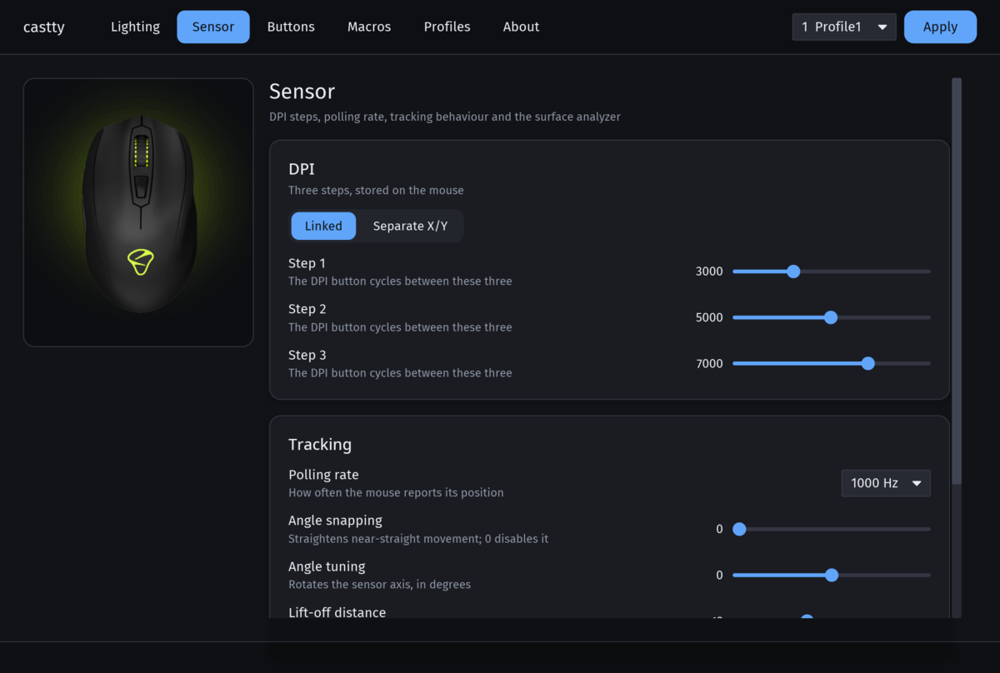
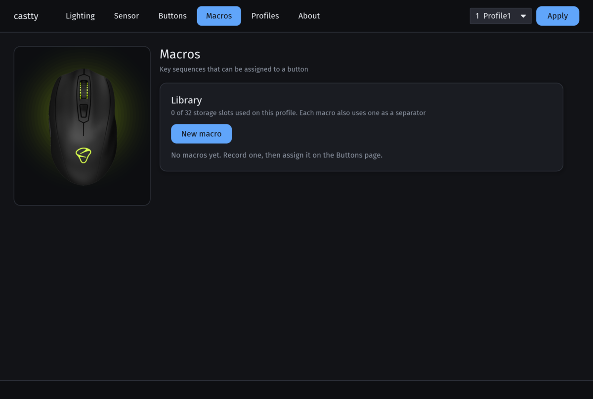
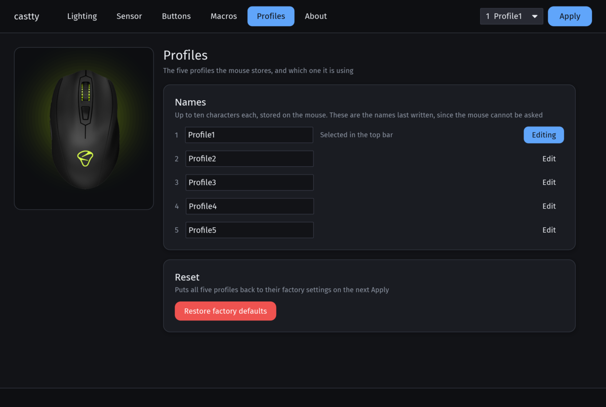
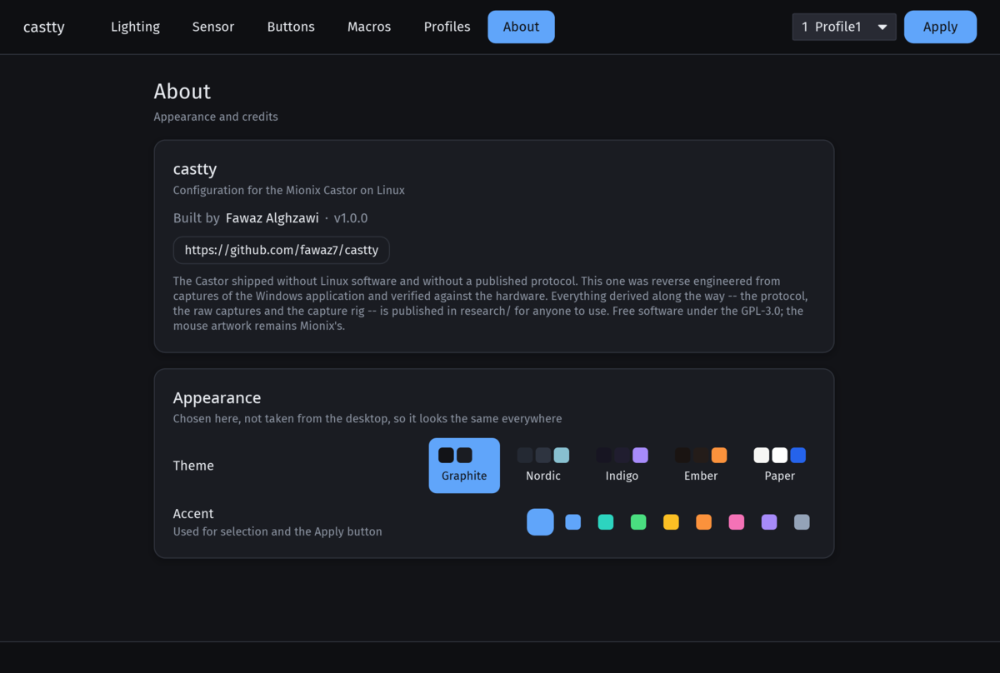

<div align="center">


# castty

**Configure the Mionix Castor on Linux.**

Lighting, DPI, polling rate, button mapping, macros and the surface analyzer — all of it, natively,
with no Wine and no Windows.

[](https://github.com/fawaz7/castty)
[](LICENSE)
[](research/PROTOCOL.md)
[](#requirements)

</div>

---

## Why this exists

I bought a Mionix Castor about ten years ago. It is still the best mouse I have ever used, and it has
been my daily driver that entire time.

When I moved from Windows to Linux, I lost control of it. Mionix never shipped Linux software, the
company is gone, the mouse has been out of production for years, and no popular tool supports it —
not OpenRGB, not libratbag, not anything I could find. The mouse kept working, but whatever settings
it had were frozen in whatever state Windows last left them.

So I took the protocol apart. I ran the original Mionix Castor software under Wine, recorded every
function as I used it, read the traffic, and mapped it byte by byte until the whole format was
understood. AI was a real help in the grind of it — diffing captures, spotting patterns, writing the
Rust — but the mouse on the desk and the bytes on the wire are what decided every question.

Then I built this app on top of it.

**All of it is here.** The protocol, the raw captures, the capture rig, the decoder — in
[`research/`](research/), documented, and free for anyone to use however they like.

And I'm not stopping at this app: **I'll be working on getting Castor support into other open source
tools — OpenRGB and libratbag in particular — soon.** A mouse that only one program can configure is
still half-orphaned. The point of documenting the protocol this thoroughly was to make that possible
for anyone, and I intend to be one of the people who does it.

---

## What works

Everything the original Windows software could do, verified against real hardware:

| | |
|---|---|
| 🎨 **Lighting** | Per-LED colour — scroll wheel and logo set independently |
| ✨ **Effects** | Solid, blinking, pulsating, breathing — plus rainbow, combinable with any of them |
| 🎯 **DPI** | Three steps, independent X and Y |
| ⚡ **Polling rate** | 125 / 250 / 500 / 1000 Hz |
| 🖱️ **Sensor** | Angle snapping, angle tuning, lift-off distance |
| 🔘 **Buttons** | Full remapping, including profile switching and single-key assignment |
| 📼 **Macros** | Record, edit, per-event timing, and hold mode |
| 👤 **Profiles** | All five, with editable names |
| 📊 **Surface analyzer** | Mionix S.Q.A.T., same scoring as the vendor tool |

The GUI and a scriptable CLI are the same binary.

---

## Screens

<div align="center">



<em>Lighting — the preview lights the wheel and logo as you pick, before anything is written</em>

</div>

<table>
<tr>
<td width="50%"><br><em>Buttons — numbered to match the callouts on the mouse</em></td>
<td width="50%"><br><em>Sensor — DPI steps, polling rate, angle tuning, lift-off</em></td>
</tr>
<tr>
<td width="50%"><br><em>Macros — record, retime, or hold</em></td>
<td width="50%"><br><em>Profiles — all five, with editable names</em></td>
</tr>
<tr>
<td colspan="2"><br><em>About — five themes and nine accents, none of them borrowed from your desktop</em></td>
</tr>
</table>

The interface is drawn with [iced](https://iced.rs) and uses none of the desktop's theming, so it
looks and behaves the same on every distribution and on both Wayland and X11. It ships its own
palettes and accents, switchable in **About**.

> Those images are generated, not staged: `cargo test --lib layout_tests` builds every page's real
> widget tree in a headless renderer and writes it to `target/ui-snapshots/` — no display, and no
> mouse plugged in.

---

## Requirements

- A **Mionix Castor**, USB ID `22d4:1316`
- Linux with `hidraw` (any modern kernel), x86-64
- A Wayland or X11 session — GPU rendering via Vulkan or OpenGL where a driver exists, software
  rendering where it doesn't
- Rust 1.88 or newer, **only if building from source**

> The Castor **PRO** (`22d4:1320`/`1321`) is a different device and is *not* supported. See
> [Contributing](#contributing) if you have one.

---

## Install

Every route installs the same four things: the binary, a **udev rule** that makes the mouse reachable
without root, a desktop entry and the icons. The udev rule is the one that is not optional — without
it `/dev/hidraw*` stays `root:root 0600` and castty finds no device.

<details open>
<summary><b>Arch Linux</b> (and Manjaro, EndeavourOS, CachyOS)</summary>

```sh
git clone https://github.com/fawaz7/castty
cd castty/packaging/arch
makepkg -si
```

</details>

<details open>
<summary><b>Debian and Ubuntu</b> (and Mint, Pop!_OS)</summary>

Grab `castty_1.0.0-1_amd64.deb` from the [latest release](https://github.com/fawaz7/castty/releases/latest):

```sh
sudo apt install ./castty_1.0.0-1_amd64.deb
```

`apt install ./file.deb` pulls in the dependencies; `dpkg -i` does not. Requires Debian 12+ or
Ubuntu 22.04+.

</details>

<details>
<summary><b>Any distribution</b> — prebuilt binary, no compiler needed</summary>

```sh
tar xzf castty-1.0.0-x86_64-linux.tar.gz
cd castty-1.0.0-x86_64-linux
./install.sh --no-build
```

From the [latest release](https://github.com/fawaz7/castty/releases/latest). The binary links only
against libc, so it runs on any glibc 2.35 or newer.

</details>

<details>
<summary><b>Any distribution</b> — from source</summary>

Needs Rust 1.88+ ([rustup](https://rustup.rs), or your package manager):

```sh
git clone https://github.com/fawaz7/castty
cd castty
./install.sh
```

The script builds, installs to `/usr/local`, sets up the udev rule and refreshes the desktop caches.
It asks for `sudo` only for the steps that genuinely need root.

`./install.sh --prefix ~/.local` installs for your user alone — root is then needed only for the
udev rule. `./install.sh --help` lists the rest.

</details>

### Then

```sh
castty info
```

Expect your firmware and current profile. If it says no device was found, **replug the mouse once** —
udev rules apply when a device connects. Then launch `castty`, or find it in your application menu.

### Uninstall

```sh
sudo pacman -R castty          # Arch
sudo apt remove castty         # Debian/Ubuntu
./install.sh --uninstall       # install.sh
```

Your settings in `~/.config/castty/` are always left alone. Your actual configuration lives on the
mouse; that directory is a fallback copy for when the mouse isn't there to be asked. Delete it by
hand if you want no trace.

---

## Command line

Launching with no arguments opens the GUI. With arguments it's a CLI, which is handy for scripting
and for startup services:

```sh
castty info                      # device identity and the profile on the mouse
castty led ff6600                # set both LEDs
castty mode breathing rainbow    # effect, optionally with rainbow
castty dpi 1 1600                # set a DPI step
castty surface                   # run the surface analyzer
castty reset                     # restore factory defaults
castty -p 2 led 00ff00           # act on profile 2
castty help                      # full usage
```

---

## Two things worth knowing

### castty shows what's on the mouse

The Castor can be read back. The Windows software never does it, and this project believed for a
while that no such command existed — but the firmware has one, and every profile comes out of flash
byte-exactly. castty reads all five when it connects, so what you see is what the mouse is actually
holding, even if it was configured from another machine or from the Windows software.

One wrinkle worth knowing about: for the first few seconds after the mouse is plugged in, it answers
a read with an empty profile and says the read succeeded. castty checks the shape of every reply and
refuses anything that isn't plainly a real profile, rather than risk writing an empty one back. If a
read is refused, or if no mouse is attached, castty falls back to the copy in `~/.config/castty/` and
shows what was last written instead.

### LED colours are approximate

The mouse's blue emitter is much dimmer than its red, so a colour with even a little red in it looks
markedly warmer on the LED than in the picker, and full blue reads as a dark navy.

This is ordinary RGB LED behaviour, and the vendor software behaves identically. castty writes the
value you picked, unchanged — a correction curve would mean sending different bytes than the colour
you chose, and would make these frames diverge from the vendor's for no real gain.

Settings are written on an explicit **Apply**, never live as you drag a colour: writes go to the
mouse's flash, and a write per drag event would be wear for nothing.

---

## The protocol

[**`research/`**](research/) is the reverse-engineering half of this project, kept deliberately
separate so it can be used without the app:

- [`research/PROTOCOL.md`](research/PROTOCOL.md) — the full wire format. Every report, every offset,
  every decoded field with its confidence level, and the things that were tested and **ruled out** so
  nobody repeats them.
- [`research/captures/`](research/captures/) — the actual frames the vendor software sent. Every claim
  in the protocol document is checkable against the bytes it came from, and the test suite asserts
  against them directly.
- [`research/tools/`](research/tools/) — the capture rig: the `LD_PRELOAD` ioctl shim, the Wine
  launcher, the capture decoder, and an 88-line standalone Python LED writer.

[`research/README.md`](research/README.md) explains the method end to end and how to reproduce a
capture yourself.

**Coming next:** I'm planning to upstream this into OpenRGB and libratbag so the Castor works with
the tools people already use, rather than only with a program written for it. If you want to help, or
you have already started, [open an issue](https://github.com/fawaz7/castty/issues) — better to do it
once, together, than three times apart.

---

## Contributing

**I only own a Castor.** That's the honest limit of this project — I can't test what I can't hold.

If you have another Mionix mouse — a Naos, an Avior, a Castor PRO — and you want it supported, the
capture rig in [`research/`](research/) is exactly what you need and it is documented for that
purpose. The protocol is likely a close relative across the range; the Castor PRO in particular
shares a software lineage. Adding a device should mostly be a matter of new captures and a byte map.

Also welcome:

- Packaging — Flatpak and Nix (Arch and Debian are covered; see [`packaging/`](packaging/))
- Testing on other distributions and compositors
- The few remaining unknowns in `research/PROTOCOL.md`
- Porting the protocol into OpenRGB, libratbag or a kernel driver — genuinely, please

### Working on it

```sh
cargo test                       # 103 tests, no hardware or display needed
cargo clippy --all-targets       # lint
cargo test --lib layout_tests    # renders every page to target/ui-snapshots/
cargo run                        # launch the GUI
cargo run -- info                # CLI, needs the mouse
```

The test suite runs entirely against the captured frames, so you can work on the protocol layer
without a mouse plugged in. Layout tests render the real widget tree headlessly, so a page that
renders nothing fails a test rather than waiting for someone to notice.

---

## Licence

**GPL-3.0.** This is free software: you can redistribute it and/or modify it under the terms of the
GNU General Public License as published by the Free Software Foundation. See [`LICENSE`](LICENSE).

Two notes, both in [`NOTICE.md`](NOTICE.md):

- The mouse render and the Mionix logo shown inside the app are **not** covered by the GPLv3 grant;
  all rights in those images remain with Mionix.
- The licence lets you fork, modify and redistribute freely, and nothing narrows that. But if you
  build something derivative from this — especially a derivative app, or significant reuse of the GUI
  or hardware layer — please keep a visible credit to **Fawaz Alghzawi** and a link to this repo in
  your README, About screen or credits. It's a small ask that goes a long way for an independent,
  unpaid side project.

Not affiliated with or endorsed by Mionix. The vendor's software is not redistributed here.

---

<div align="center">

Built by [Fawaz Alghzawi](https://github.com/fawaz7) · for a ten-year-old mouse that deserved better

</div>
